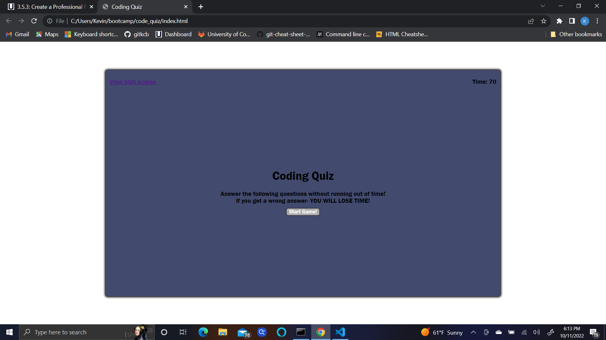

# code_quiz

## Description
The motivation for this project was to create a page that would quiz a user on the skills we've learned in the program so far. This is a timed quiz that if your get wrong answers will deduct time and save the users highscore. I learned that it is useful to plan out your code before working on it. This will make it easier to do the things you need to to complete the assignment.

## Usage

.png)
.png)
.png)
.png)

